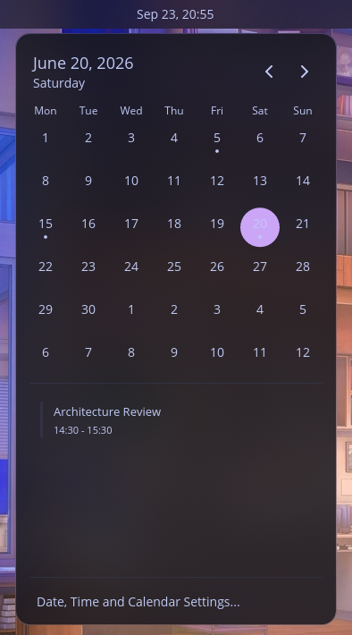

# COSMIC Calendar Applet (`cosmic-ext-applet-calendar`)

[](https://www.gnu.org/licenses/gpl-3.0)
[](https://github.com/pop-os/cosmic-epoch)
[](https://www.rust-lang.org/)

A standalone calendar and agenda applet for the Pop!_OS COSMIC Desktop. Fetches events from Evolution Data Server (Google Calendar, Nextcloud, CalDAV) and local `.ics` files, displaying event dots on the monthly calendar grid and an agenda list for selected days.

Built as an independent applet using `libcosmic`, decoupled from the core `cosmic-applets` monorepo.

---

## Screenshots

| Event with Meeting Link | Empty State |
| :---: | :---: |
|  |  |

| Standard Agenda View | Localization & Real CalDAV Sync |
| :---: | :---: |
|  |  |

---

## Features

- **Google Calendar, Nextcloud & CalDAV Sync:** Queries Evolution Data Server (EDS) over D-Bus with zero configuration if your account is signed in via GNOME Online Accounts or Evolution.
- **Local `.ics` File Support:** Auto-discovers calendar and public holiday `.ics` files in `~/.local/share/calendars/`, `~/.local/share/cosmic-calendar/`, and `/usr/share/calendar/`.
- **Calendar Event Dots:** Monthly grid shows indicator dots beneath days with scheduled events.
- **Chronological Agenda:** Selecting a day lists its events sorted by time (all-day events at top) with title, time, and location.
- **One-Click Meeting Join:** Detects Google Meet, Zoom, and Microsoft Teams URLs and launches them in your default browser.
- **Battery & Performance Optimization:** Zero background polling or CPU wakeups when the popup is closed. In-memory LRU cache with a 60-second TTL provides instant 0ms month navigation.
- **Fault-Tolerant Deduplication:** Deduplicates events appearing across multiple calendars or identical recurring instances without dropping distinct meetings at the same hour.
- **40+ Language Translations:** Built-in localization support via Fluent.

---

## Installation

### Method 1: Quick Install (Recommended)

Downloads the prebuilt binary and installs it to `~/.local/bin/`:

```bash
curl -fsSL https://raw.githubusercontent.com/Hasmolam/cosmic-ext-applet-calendar/main/install.sh | bash
```

To also replace your top bar's digital clock:
```bash
curl -fsSL https://raw.githubusercontent.com/Hasmolam/cosmic-ext-applet-calendar/main/install.sh | bash -s -- --replace-clock
```

### Method 2: Build with Just (Standard System Install)

Requires `cargo` and `just`:

```bash
git clone https://github.com/Hasmolam/cosmic-ext-applet-calendar.git
cd cosmic-ext-applet-calendar
just build
sudo just install
```

### Method 3: Build from Source with Cargo

```bash
git clone https://github.com/Hasmolam/cosmic-ext-applet-calendar.git
cd cosmic-ext-applet-calendar
cargo build --release
./install.sh
```

---

## Usage Modes

This applet natively supports two distinct operational modes:

1. **Standalone Panel Applet (Default):**
   Displays a calendar icon with today's day of the month (e.g. `📅 24`) in your panel or dock.
   Go to **Settings → Desktop → Panel → Applets**, search for **Calendar & Agenda**, and add it anywhere.
2. **Drop-in Clock Replacement:**
   Replaces the default COSMIC digital clock (`cosmic-applet-time`) on your top bar, retaining standard time formatting while opening the calendar and agenda on click. Enabled via `./install.sh --replace-clock`.

---

## Uninstallation

To completely remove the applet and restore the default system clock:

```bash
curl -fsSL https://raw.githubusercontent.com/Hasmolam/cosmic-ext-applet-calendar/main/uninstall.sh | bash
```

Or manually:

```bash
rm -f ~/.local/bin/cosmic-ext-applet-calendar ~/.local/bin/cosmic-applet-time
rm -f ~/.local/share/applications/io.github.hasmolam.cosmic-ext-applet-calendar.desktop
rm -f ~/.local/share/icons/hicolor/scalable/apps/io.github.hasmolam.cosmic-ext-applet-calendar-symbolic.svg
killall cosmic-panel
```

---

## Architecture

```
libcosmic Window Loop
       │
       ▼
  EventCache (LRU, 60s TTL)
       │
       ▼
CompositeBackend
  ├── LocalIcsBackend (~/.local/share/calendars/*.ics)
  └── EdsBackend (org.gnome.evolution.dataserver.Calendar over zbus 5 D-Bus)
```

The applet implements a modular `CalendarBackend` trait. When official COSMIC Accounts support is released in upstream COSMIC, adding support requires only implementing the trait.

---

## License

GPL-3.0-only. See [LICENSE](LICENSE) for details.
